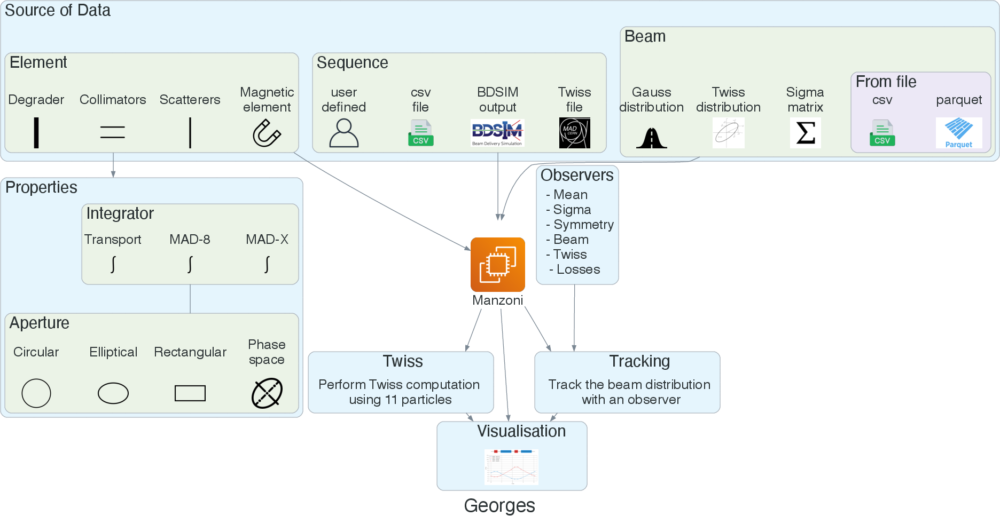

*******
Manzoni
*******

Particle tracking
=================

The Manzoni module aims to implement fast particle beam tracking through the most encountered accelerator
and beamline elements (magnets, scatterers and degraders, collimators and cavities).

The transport of charged particles in a magnetic element can be described using the following matrix formalism:

.. math::
    X_i = \sum_j X_j R_{ij} + \sum_{jk} X_{ij} T_{ijk},

where ``X`` is a vector containing the particle's properties, and ``R`` and ``T`` are the propagation matrices and tensors,
respectively. This matrix formalism is notably employed in the particle accelerator field due to its effectiveness in
mathematically describing the dynamics of charged particles moving through electromagnetic fields. It simplifies the
analysis of particle behavior, facilitates beam optimization and component design, and enables accurate particle
accelerator simulations.

For each element, a first (``𝑅``) and second-order (``𝑇``) type propagation is implemented, allowing the user to select
the proper tracking order for his specific application. Three different integrator types are implemented in Manzoni:

    * MadX
    * Transport
    * MAD-8

The user should be aware that the canonical variables of the particles are not the same for the three different integrator
types, so the definition of the beam must be done accordingly to be consistent. The integrators ``Mad8-type`` and
``Transport`` add higher-order terms (``𝑇``) to the matrix formalism, as the output coordinate does not depend linearly
on the coordinate of the incoming particle. On the other hand, the ``MadX`` integrator is linear in the spatial coordinates
and angles but exact in the momentum deviation, making it much more precise when we are interested in beams with a large
energy spread.

Structure
=========

The module is structured as depicted in figure below and described in the next sections:

* :ref:`elements`
* :ref:`apertures`
* :ref:`beam`
* :ref:`input`
* :ref:`core`
* :ref:`integrators`
* :ref:`kernels`
* :ref:`maps`
* :ref:`observers`

..  toctree::
    :hidden:
    :maxdepth: 1

    manzoni/structure

Examples
========

..  toctree::
    :maxdepth: 1

    manzoni/example_tracking
    manzoni/example_energy_degradation

Validation
==========

..  toctree::
    :maxdepth: 1

    manzoni/madx_validation
