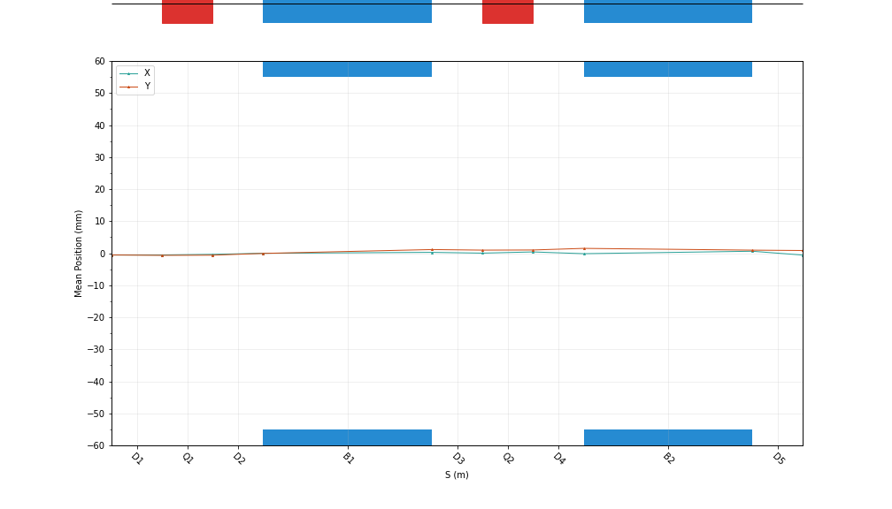
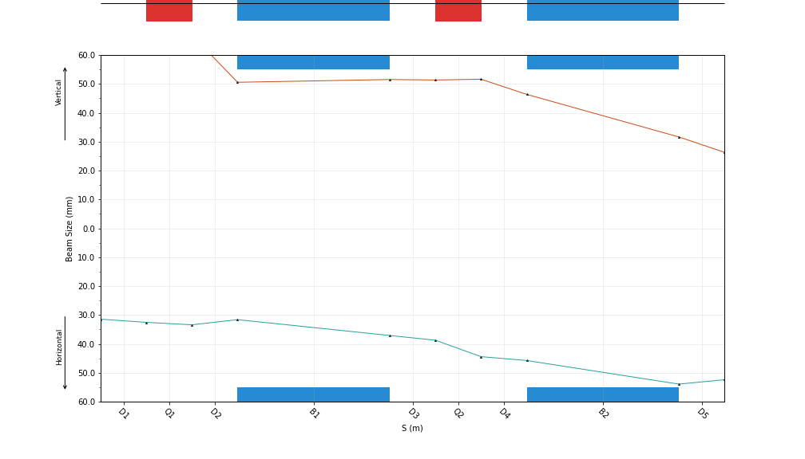
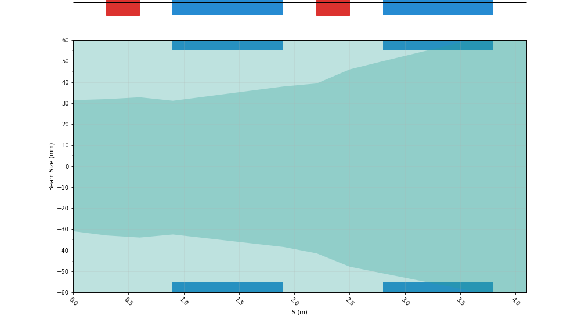
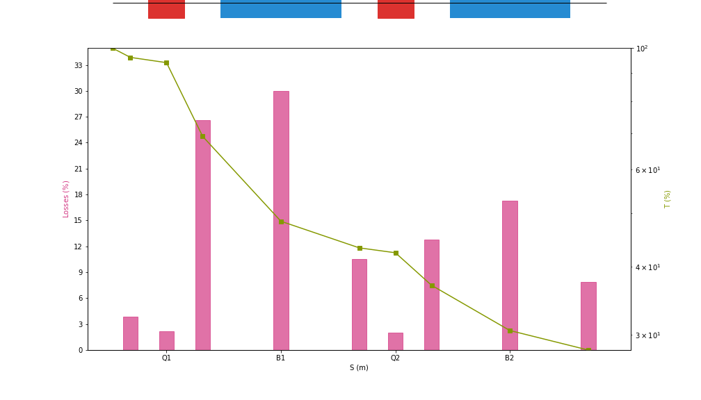
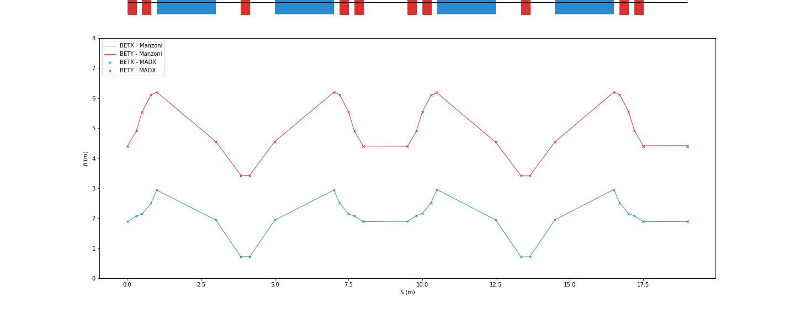

*******************************************
Georges’s visualization and plotting module
*******************************************

This module uses the georges-core's plotting module []. It can uses the *Matplotlib* ot the *Plotly* library as backend.
After defining a *ManzoniArtist()*, the beamline can be displayed with different options:

+----------------+------------------+----------------+
| argument       |  type            |  default value |
+================+==================+================+
| beamline       | pandas.DataFrame | None           |
+----------------+------------------+----------------+
| print_label    | bool             | False          |
+----------------+------------------+----------------+
| with_cartouche | bool             | True           |
+----------------+------------------+----------------+
| with_aperture  | bool             | False          |
+----------------+------------------+----------------+
| plane          | str              | None           |
+----------------+------------------+----------------+

Example::

    plt.rc('text', usetex=False)
    fig = plt.figure(figsize=(20,8))
    ax = fig.add_subplot(111)
    manzoni_plot = vis.ManzoniMatplotlibArtist(ax=ax)
    manzoni_plot.plot_beamline(sequence.df, print_label=False, with_cartouche=True, with_aperture=False, plane='X')

If an observer has been used in the simulation, the results can be added to the previous figure depending the
instance of the observer::

    mi = Input.from_sequence(sequence=sequence)
    beam_observer_std = mi.track(beam=beam, observers=observers.SigmaObserver())
    beam_observer_mean = mi.track(beam=beam, observers=observers.MeanObserver())
    beam_observer_beam = mi.track(beam=beam, observers=observers.BeamObserver(with_input_beams=True))
    beam_observer_losses = mi.track(beam=beam, observers=observers.LossesObserver())

    manzoni_plot.tracking(beam_observer_mean, plane='X')

::

    manzoni_plot.tracking(beam_observer_std, plane='both')

::

    manzoni_plot.tracking(beam_observer_beam, fill_between=False, plane='X', mean=False, std=False, halo=True)

::

    manzoni_plot.phase_space(observer=beam_observer_beam,
                             element='Q1',
                             dim=['X', 'PX'],
                             location='OUT',
                             nbins=[51, 51])

.. image:: images/phase_space_observer_matplotlib.png

::

    manzoni_plot.losses(beam_observer_losses, log_scale=True)

::

    manzoni_plot.twiss(tw_observer, with_beta=True, with_alpha=False, with_dispersion=False, tfs_data=madx_line.df)

