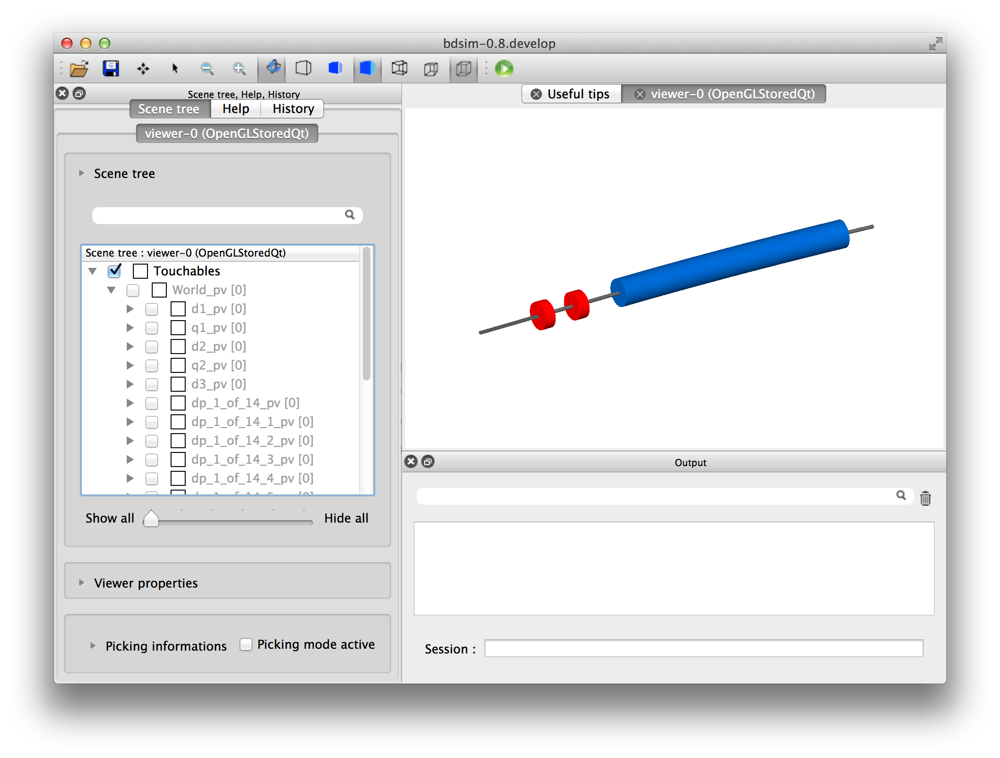

Builder
=======

1_testmachine.py
----------------

A simple machine with a few drifts, quadrupoles and a long dipole. This is
not matched or properly designed, but purely an example to show and test
the construction and writing of a lattice using the `Builder.Machine` class.

How to run::

  ./1_testmachine.py
  bdsim --file=testlattice.gmad

  
